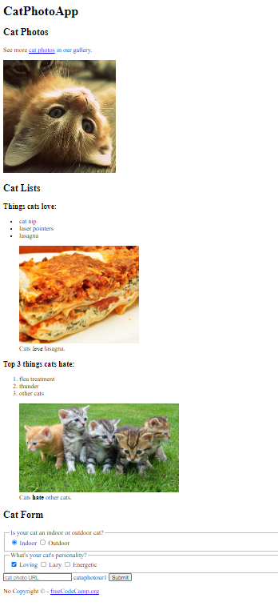

# Cat photo app

> One paragraph statement about the project.



Additional description of the project and its features.

## Built With
- HTML5 elements,
- Ordered list <ol>,
- Unordered list <ul>,
- Form, input, figure, main,
- Linters
-Prettier
-Stylelint
- Github Action
  

## Live Demo

[Live Demo Link](<02-/Screenshot (177).png>)

### Development (Running locally)

- Clone the project

```bash
git clone  https://github.com/Gbemisola19/01-fcc-cat-photo-app.git

```

- Install Dependencies

```bash
yarn install
```

To run StyleLint by itself, you may run the lint task:

```bash
yarn lint:check
```

Or to automatically fix issues found (where possible):

```bash
yarn lint
```

You can also check against Prettier:

```bash
yarn format:check
```

and to have it fix (to the best of its ability) any format issues, run:

```bash
yarn format
```

You can also check against HTML Validator (htmlhint):

```bash
yarn lint:html
```

To generate an accessibility report for this webpage, run the below command, it uses axe:

```bash
yarn axe
```

## Style Guides

- [CSS Style Guide](http://udacity.github.io/frontend-nanodegree-styleguide/css.html)
- [HTML Style Guide](http://udacity.github.io/frontend-nanodegree-styleguide/index.html)
- [JavaScript Style Guide](http://udacity.github.io/frontend-nanodegree-styleguide/javascript.html)
- [Git Style Guide](https://udacity.github.io/git-styleguide/)
- [AXE Accessibility Style Guide](https://dequeuniversity.com/rules/axe/html/4.7)

## 👤 Author

- Github: [@author](https://github.com/Gbemisola19)
- Twitter: [@author](https://twitter.com/Oladipoazeezat)
- Linkedin: [@author](https://www.linkedin.com/in/author/)

## 🤝 Contributing

Contributions, issues and feature requests are welcome!

Feel free to check the [issues page](../../issues).

## Show your support

Give a ⭐️ if you like this project!

## Acknowledgments

- Hat tip to anyone whose code was used
- Inspiration, resources/assets used
- etc

## 📝 License

[MIT licensed](./LICENSE).
